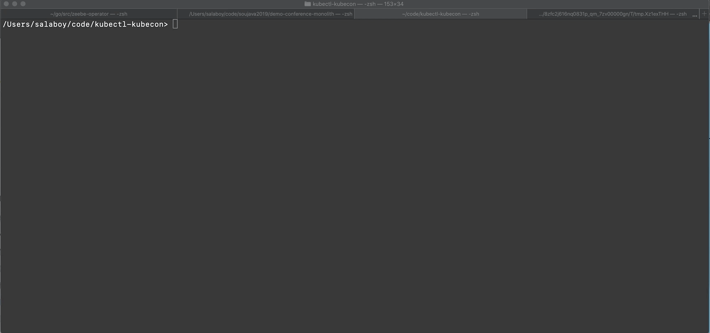

# KUBCON KubeCTL Plguin 

This plugin allows you to keep track how much time remains to the next KubeCon. It gives you a friendly reminder about the conference date and the C4P deadline. 

# Depends on 
- Core Utils: `brew install coreutils` for gdate
- Cowsay: `brew install cowsay`

Kudos to [@esteban-aliverti](http://github.com/esteban-aliverti) for the Bash/Shell contributions and CowSay reference. 

